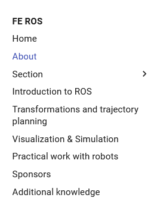
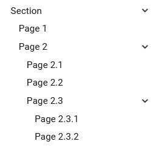

# fe-ros-docs
Holds the source file for the Github Pages webpage built with [MkDocs](https://www.mkdocs.org/).

The sources get automatically built on every push to the `main` branch.
# Contribution instructions


## Building locally

As stated before, the publicly available page gets built on every push to the `main` branch. This is great in terms of reducing the require effort it takes to deploy a webpage. But it's not optimal when it comes to writing the content, playing with the styles, editing the hierarchy, etc. That is because it takes a while until the page is built and we can see the changes we made. To help we that, we can build the page locally!

To achieve this we need install the **mkdocs** builder locally. There's a nice guide that details how to achieve this available on the [officion mkdocs documentation](http://127.0.0.1:8000/fe-ros-docs/).

To sum it up:

1. Install the `mkdocs` with `pip`
    ```
    pip install mkdocs
    ```
2. Navigate to the root directory of this repository
    ```
    cd <path>/<to>/<this>/<repo>/fe-ros-docs
    ```
3. Run `mkdocs`:
    ```
    mkdocs serve
    ```
4. You can now see the built page on:[127.0.0.1:8000](http://127.0.0.1:8000/fe-ros-docs/).

**Note:** You do not need to rebuild the page on every change - `mkdocs` automatically detects changes and rebuilds it for you.

### Docker
If you have the Docker Engine installed you can use this this command to serve the webpage (credit to [squidfunk/mkdocs-material](https://hub.docker.com/r/squidfunk/mkdocs-material)):
```
docker run --rm -it -p 8000:8000 -v ${PWD}:/docs squidfunk/mkdocs-material
```
**Note**: You should be in the repo's directory before running this.

## How it works

This documentation is compiled using `mkdocs`. The first point of reference therefore is the [Documentation of Mkdocs](https://www.mkdocs.org/user-guide/writing-your-docs/).

> MkDocs is a fast, simple and downright gorgeous static site generator that's geared towards building project documentation. Documentation source files are written in Markdown, and configured with a single YAML configuration file. Start by reading the introductory tutorial, then check the User Guide for more information

## Navigation pane

The top-level navigation hierarchy is defined in the `mkdocs.yml` file:
```yaml
nav:
    ...
```

Each key in the YAML under `nav` defines an entry in the navigation pane on the right of the page. Like in the image below:



### One-level navigation pane items

To define what content gets displayed when visiting an item from the navigation pane it is neccessary to define the value of the key. For example, the key/value pair for the `About` item is defined like so:
```yaml
    ...
    - About: 'about/index.md'
    ...
```
The key represents the text that gets displayed in the navigation pane, whereas the value defines the markdown document that is read and compiled into the content of the page.

### Multi-level navigation pane items

We can add multiple levels of children to each item in the navigation pane. To achieve this we populate a key in the under `nav` with another key instead of a value. Look at the image below and the `Section` item in the navigation pane:



The YAML definition of such hierarchi looks something like this:
```yaml
    ...
    - Section: 
        - Page 1: 'section/page-1.md'
        - Page 2:
            - Page 2.1: 'section/page-2.1.md'
            - Page 2.2: 'section/page-2.2.md'
            - Page 2.3:
                - Page 2.3.1: 'section/page-2.3.1.md'
                - Page 2.3.2: 'section/page-2.3.1.md'
    ...
```
