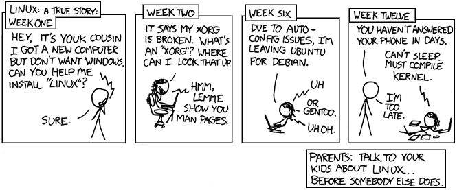

## The command line

When people hear of Linux one of the first things that come to their mind is the big scarry command line interface. When you followed the previous instructions you switched to something called **Virtual Terminal**. We will be spending only a little time in here so don't worry about it. By the end of this chapter we will be back to the nice and cosy Desktop Environment.

What you have in front of you is how the command line **typically** (modifications can be made, of course) looks:

```
user@ubuntu:~$
```

Let's inspects what is displayed in there:
- `user` - tells us who is logged in
- `@ubuntu` - tells us the name of the machine we are using
- `~` - tells us what is the current working directory
- `$` - tells us we are logged in as a normal user (as opposed to `root`, but more about this later).

> **Note**: The computer that you are using my display different values for the user and machine name. Do no be confused about it, the meaning remains the same.

We can try typing a command and see what happens:

```
user@ubuntu:~$ bring-me-coffee
bring-me-coffee: command not found
```
That's sad, right? But what are the commands we can use and who decides what's a good command and what not? Where are the rules written?

## The shell
<!-- Hidden information -->
<!-- The content in this page was inspired by: -->
<!--  https://www.educative.io/courses/master-the-bash-shell/3j8399P3M6M -->

The shell is a program on the operating system that processes the commands we provide it and returns results. The most common shell in Linux and the one we will be using throughout the workshop is `bash` ([GNU Bash](https://www.gnu.org/software/bash/)).

From [educative.io](https://www.educative.io/courses/master-the-bash-shell/3j8399P3M6M):
> Bash is a shell program.
> A shell program is typically an executable binary that takes commands that you type and (once you hit return),translates those commands into (ultimately) system calls to the Operating System API.

If you want to know what Bash can do simply ask:
```
$ help
```
That was not useful, was it? :) That is why we are having this workshop today.

> **Note** From now on, we will be omitting the preamble (i.e. `user@ubuntu` from the commands).

## The first command - `echo`

Let's type the first command that is recognized by Shell and that is useful:
```
$ echo
```

What happened?

## Looking for help

After running the first command you're probably disappointed that nothing "cool" happened. You're probably also wondering why did we say that you will run a "useful" command.

Well, a command is useful when used right. Knowing where to look for help is a very powerful asset when working in Linux. We can use two built-in commands to learn how certain other commands work: `help` and `man`. Let's use the two to learn more about `echo`:

```
$ help echo
```

You're now met with a short documentation how to use `echo`:
```
echo: echo [-neE] [arg ...]
    Write arguments to the standard output.

    Display the ARGs, separated by a single space character and followed by a
    newline, on the standard output.

    Options:
      -n        do not append a newline
      -e        enable interpretation of the following backslash escapes
      -E        explicitly suppress interpretation of backslash escapes

    `echo' interprets the following backslash-escaped characters:
      \a        alert (bell)
      \b        backspace
      \c        suppress further output
      \e        escape character
      \E        escape character
      \f        form feed
      \n        new line
      \r        carriage return
      \t        horizontal tab
      \v        vertical tab
      \\        backslash
      \0nnn     the character whose ASCII code is NNN (octal).  NNN can be
                0 to 3 octal digits
      \xHH      the eight-bit character whose value is HH (hexadecimal).  HH
                can be one or two hex digits

    Exit Status:
    Returns success unless a write error occurs.
```

Let's also try `man`:

```
$ man <command>
```

> **Tip:** Use `man` to open the manual of a command. When opening a manual page, our whole screen changes a bit. That is because we enter the manual of a command. In here, we can navigate up and down the page with the use of `Arrow Up` and `Arrow Down` keys. To exit the manual page, simply press the `Q` button.

We go back to the output of `$ help echo` and focus one the first couple of lines in this documentation:
```
echo: echo [-neE] [arg ...]
    Write arguments to the standard output.

    Display the ARGs, separated by a single space character and followed by a
    newline, on the standard output.
```

When using shell commands we differentiate between arguments and flags. Flags come right after the command are additional options and usually have a leading dash `-` or double dash `--`. Arguments are usually at the end. Let's now use the `echo` command with an argument:
```
$ echo This workshop is amazing!
This workshop is amazing!
```

See? Much better!


## Let's tell the computer to get us coffee (i.e. the `alias` command)

As we learned before, Bash does not recognize `bring-me-coffee` as a valid command. Let's change this by
defining `bring-me-coffee` as an `alias`.

We should first learn how this command is used:
```
$ alias --help
alias: alias [-p] [name[=value] ... ]
    Define or display aliases.

    Without arguments, `alias' prints the list of aliases in the reusable
    form `alias NAME=VALUE' on standard output.

    Otherwise, an alias is defined for each NAME whose VALUE is given.
    A trailing space in VALUE causes the next word to be checked for
    alias substitution when the alias is expanded.

    Options:
      -p        print all defined aliases in a reusable format

    Exit Status:
    alias returns true unless a NAME is supplied for which no alias has been
    defined.
```

We will now use the `alias` command do tell Bash what `bring-me-coffee` should do:
```
$ alias bring-me-coffee="echo Go get it yourself!"
```

Try it out:
```
$ bring-me-coffee
```

After reading this you're probably asking yourself: "How will this bring me coffee?". We never promised you coffee, we said that we want Bash to recognize the command ¯\\\_(ツ)\_/¯.

A relevant XKCD comic at the end: [https://xkcd.com/456/](https://xkcd.com/456/)

