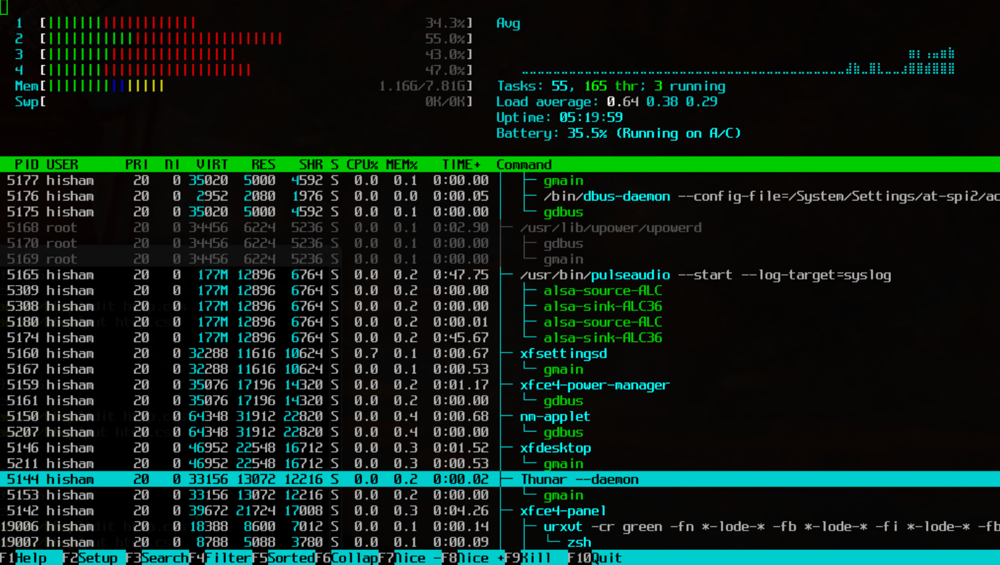

Until now we executed every command or script in a way that the result was immediately visible. That is also because most of the commands and processes did not take much time. In this part of the workshop we will learn how to manage processes in the foreground and background. We will also learn how to stop a process running in the background and monitor a process' resource usage.

In this part of the workshop we will be starting up programs that have a graphical user interface (GUI). That is because those programs are running for a longer time.

Before proceeding, let's make sure our working directory is `~/Documents`:
```
$ cd ~/Documents
```

## Running processes in the foreground and background
<!-- Hidden information -->
<!-- The content in this page was inspired by: -->
<!-- https://linuxize.com/post/how-to-run-linux-commands-in-background/ -->

In this section we will acquaint ourselves with a simple text editor with a graphical user interface - `gedit`. From [https://help.gnome.org](https://help.gnome.org/users/gedit/stable/gedit-quickstart.html.en):
> gedit is a full-featured text editor for the GNOME desktop environment. You can use it to prepare simple notes and documents, or you can use some of its advanced features, making it your own software development environment.

To open `gedit` simply execute the following command:
```
$ gedit
```

After executing this command you should be met with `gedit`'s GUI:


Feel free to write something. When you're done, save the text into a file. We will call the file `gedit_text.txt`.

Question: How would you close `gedit`?
When closing graphical applications, we usually search for the `X` sign in the top-right corner. Pressing it indeed closes `gedit`. However, we can also close it from the terminal by pressing `Ctrl+C`. Linux implements a series of signals that can be sent to a process. The `Ctrl+C` key combination is a shortcut to send the `SIGINT` (interrupt signal) to the currently running process.

For the sake of trying, let's open `gedit` again and this time we close it with `Ctrl+C`. You will notice that before `gedit` quits, a `^C` is printed. This means that the `Ctr+C` key was pressed.

> **Note**: To get a list of all available kill signals simply type `kill -l`:
> ```
>  1) SIGHUP       2) SIGINT       3) SIGQUIT      4) SIGILL       5) SIGTRAP
>  6) SIGABRT      7) SIGBUS       8) SIGFPE       9) SIGKILL     10) SIGUSR1
> 11) SIGSEGV     12) SIGUSR2     13) SIGPIPE     14) SIGALRM     15) SIGTERM
> 16) SIGSTKFLT   17) SIGCHLD     18) SIGCONT     19) SIGSTOP     20) SIGTSTP
> 21) SIGTTIN     22) SIGTTOU     23) SIGURG      24) SIGXCPU     25) SIGXFSZ
> 26) SIGVTALRM   27) SIGPROF     28) SIGWINCH    29) SIGIO       30) SIGPWR
> 31) SIGSYS      34) SIGRTMIN    35) SIGRTMIN+1  36) SIGRTMIN+2  37) SIGRTMIN+3
> 38) SIGRTMIN+4  39) SIGRTMIN+5  40) SIGRTMIN+6  41) SIGRTMIN+7  42) SIGRTMIN+8
> 43) SIGRTMIN+9  44) SIGRTMIN+10 45) SIGRTMIN+11 46) SIGRTMIN+12 47) SIGRTMIN+13
> 48) SIGRTMIN+14 49) SIGRTMIN+15 50) SIGRTMAX-14 51) SIGRTMAX-13 52) SIGRTMAX-12
> 53) SIGRTMAX-11 54) SIGRTMAX-10 55) SIGRTMAX-9  56) SIGRTMAX-8  57) SIGRTMAX-7
> 58) SIGRTMAX-6  59) SIGRTMAX-5  60) SIGRTMAX-4  61) SIGRTMAX-3  62) SIGRTMAX-2
> 63) SIGRTMAX-1  64) SIGRTMAX
> ```

### `fg`

We now know how to start a process and how to terminate it. But what you will notice is that when a process is running, the command line is not usable. Try executing `echo I can't be printed`. You will notice that the desired message does not get printed.

To start a process and sending it to the background right away we use the `&` operator. Let's try starting `gedit` and sending it to the background right away:
```
$ gedit &
```

You will notice that the usual `gedit` messages get printed. If you now press `Enter` you will see that the command line returns to normal and you can now use it as if `gedit` is not running. This is because it is running in the background.

As mentioned before, `gedit` is a graphical application and can be closed by pressing the top-right `X` sign. What about processes that do not have a graphical user interface (GUI)? How would we close those?

Execute the following command:
```
$ sleep 2
```

The `sleep` commands wait for the defined time in seconds and then quits. The above command will therefore wait for 2 seconds and then quit. Not too exiting. Try executing it with the `&` at the end:
```
$ sleep 2 &
[1] 6691
```

You will see the terminal printing some information about the process that has been sent into the background. The number `[1]` refers to the  sequential number of the job that we put into the background. The four digit number that follows is the process identifier, commonly referred to as PID. If you press `Enter` again the terminal will inform you that the processes has concluded:
```
[1]+  Done                    sleep 2
```

> **Note**: The PID that was displayed above was the PID that was displayed when writing this document. The PIDs are more or less randomly determined so you probably saw a different value.

Let's increase the time for the sleep to 60 seconds. Don't worry, we are not going to just wait that this one minute is over. We are increasing the time so we can try terminating the process with `Ctrl+C`.
```
$ sleep 60 &
[1] 6791
```

Try pressing `Ctrl+C`. You will notice that nothing happens, the process is still running. To terminate it, we need to first bring it from the background into the foreground. We do this with the `fg` command:
```
$ fg
sleep 60
```

When executing the `fg` command, the terminal will inform you what process have you brought into the foreground. In our case it is `sleep 60`. We can now terminate it with the `Ctrl+C`.

We can place as many processes in the background as we want. Let's try executing the `sleep 60 &` command multiple times, like three times:
```
$ sleep 60 &
$ sleep 60 &
$ sleep 60 &
```

All the three `sleeps` are now in the background. To list all the processes running in the background of the current terminal simply execute the `jobs` command:
```
$ jobs
jobs
[1]   Running                 sleep 60 &
[2]-  Running                 sleep 60 &
[3]+  Running                 sleep 60 &
```

To stop the 2nd sleep command simply type
```
$ fg %2
```

### `bg`

Imagine the following scenario: You started `gedit` in the foreground (i.e. without the `&` at the end) and wrote some very important things into the document. However, you realized that you are missing a piece of information that needs `sudo cat ...` to retrieve. You don't want to lose all that you've written until now but at the same time you don't want to deal with saving the document, closing `gedit`, finding the info and opening `gedit` again. You simply want to put `gedit` in the background for a short time.

We achieve this with `Ctrl+Z`. When pressing `Ctrl+Z` we send the `SIGTSTP` (suspend signal) to a running program. This essentially suspends the program and returns us the control to shell.

Try running `gedit` and then press `Ctrl+Z`. You will see the following:
```
^Z
[1]+  Stopped                 gedit
```

It says that `gedit` is stopped. However, you still see its GUI. The GUI is visible, but we cannot type anything in it. That is because the process is stopped (not terminated!). A person that does not know what is going on could panic a bit because the program is not responding and we've already wrote some important things into it. No reason to panic! We can now resume the program with the `bg` command. This will instruct Linux to put `gedit` into the background and resume it. This is the same behavior we've seen when starting a process with a `&` at the end. As you can see, we can again interact with `gedit` and type things into our file.

If we now want to bring the process back into the foreground, we simply type `fg`.

> **Further reading**:
>
> - https://linux.die.net/Bash-Beginners-Guide/sect_12_01.html
> - https://medium.com/@aantipov/what-happens-when-you-ctrl-c-in-the-terminal-36b093443e06

## Killing processes in the background

Sometimes there are processes running in the background that were not started by us or they were started in a different terminal. In those cases, we cannot access them by by `fg` and simply stop them with a `Ctrl+C`.

Before proceeding, start `gedit` with the trailing `&` so it runs in the background:
```
$ gedit &
```

Now close the terminal and open it again. Type `fg`, what do you see?
```
$ fg
-bash: fg: current: no such job
```

### Using `ps` and `kill`

In the previous section we mentioned something called the "Process ID" or PID. The PID is a unique identifier of a process. To retrieve the PID of a process we can use the `ps` command. Try it out:
```
$ ps
  PID TTY          TIME CMD
 3683 pts/7    00:00:00 bash
 3978 pts/7    00:00:00 ps
```

The `ps` command listed `bash` and `ps` as currently running processes. The first, `bash` is obvious as it is the current program on the operating system that processes the all the commands we provide it through the terminal. The second, `ps`, is the result of us running `ps` when listing all the running processes. Obviously, we started `ps` to list all the running processes and it identified itself as a running process.

For each process we see the following information:

- `PID` - the PID of the process
- `TTY` - the name of the terminal the process was started in
- `TIME` - the total accumulated CPU utilization time for a particular process
- `CMD` - the command that started the process

Question: Do you think these really are all the processes that are currently running? Where is `geddit` that we started before?

Let's try to provide `ps` some more flags and see a bit richer output:
```
$ ps -A
```

Now you are probably overwhelmed by the output! Do you see the `geddit` process anywhere?

> **Note**: Remember `grep`! Use `ps ax | grep gedit`.

The added `-A` flag means the following: `all processes` (type `ps --help a` to see some other options).

Have a close look at `gedit`, what do you see in the `TTY` column? A question mark `?` denotes, that the terminal that started that process is no longer available or does not exist.

We can now terminate `gedit` with the `kill` command. The kill command sends a signal to a job. The default signal that `kill` sends to a process is `SIGTERM` (this is not the same signal that `Ctrl+C` sends). If a process is stuck, it might not react to `SIGNTERM` so you might want to use a more forceful signal, like `SIGKILL` (or `-s 9` when used with `kill`).

To terminate `gedit` simply run `kill` with `gedit`'s PID
```
$ kill <GEDIT_PID>
```

### Intermediate exercise

Start `gedit` in the background (`gedit &`). Use multiple commands to terminate `gedit` without manually typing its PID. To complete this task, try to use the following commands in succession like we learned before: `grep`, `tr` & `cut`.

> **Note:** Use `man` and `help` (or `--help`) to figure out how to use these previously unknown commands!


Solution:
```
$ kill $(ps -A | grep gedit | tr -s ' ' | cut -d ' ' -f 2)
```


> **Further reading**:
>
> - https://www.cyberciti.biz/faq/unix-kill-command-examples/
> - https://man7.org/linux/man-pages/man7/signal.7.html
<!-- Hidden information -->
<!-- The content in this page was inspired by: -->
<!-- https://linuxize.com/post/ps-command-in-linux/ -->

### Using `htop`
We all love the command line and stacking multiple commands together to achieve the desired result is comparable to drinking some very fine wine. However, it sometime is a little bit time consuming and we can quickly forget the different tricks we used. That is why it is advised to sometimes also use tools that make our lives easier.

To monitor currently running processes we can also use `htop`. This program is not always available so we might need to install it first:
```
$ apt install `htop`
```

After starting `htop` you are greeted with its Command Line Interface - CLI.
```
$ htop
```

The CLI looks something like this (image credits to [https://htop.dev](https://htop.dev)):


With `htop` you can sort processes based on the resources they use (e.g. memory or processor), filter processes based on names, search processes, and also terminate them. To exit htop we can either use `Ctrl+C` or simply press the `q` key. Let's do just that, quit `htop`.

To demonstrate how `htop` can be used to terminate a process, we will start `gedit` in the background again:
```
$ gedit &
```

Open `htop`. Read the lines at the bottom that state:
`F1 Help`, `F2 Setup`, `F3 Search`, `F4 Filter`, `F5 Sorted`, `F6 Collap`, `F7 Nice -`, `F8 Nice +`, `F9 Kill`, `F10 Quit`

We press the `F4` key to `filter` the processes, then type `gedit` and then press the `Enter` key to confirm the search pattern. We will likely see multiple lines. Best is, to terminate all of them! Simply press the `Space` key and you will see that the first line was selected. Press `Space` again until all lines are selected and then press the `F9` key. On the side you will see a list of signals you can send to the process. To kill it, send `SIGKILL` by selecting it with the `9`. Confirm the selection with the `Enter` key.
### Intermediate exercise

Start `htop` in the foreground and then do the following:
- Place `htop` in the background
- Start `gedit` in the background
- Place `htop` in the foreground again
- Kill `gedit`

<!-- Hidden information -->
<!-- The content in this page was inspired by: -->
<!-- https://spin.atomicobject.com/2020/02/10/htop-guide/ -->