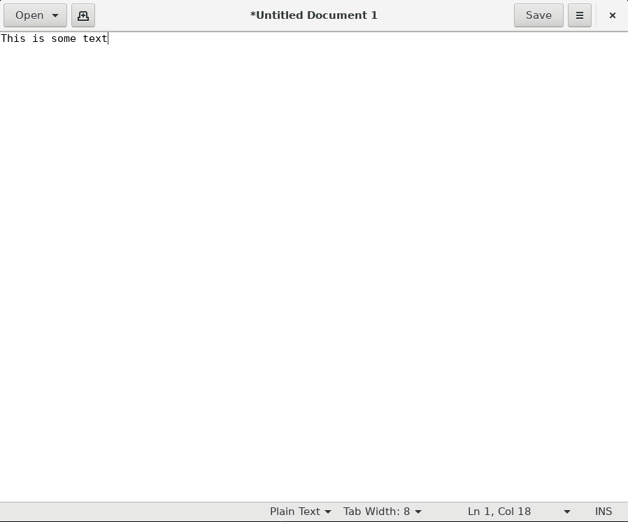

Until now we executed every command or script in a way that the result was immediately visible. That is also because most of the commands and processes did not take much time. In this part of the workshop we will learn how to manage processes in the foreground and background. We will also learn how to stop a process running in the background and monitor a process' resource usage.

In this part of the workshop we will be starting up programs that have a graphical user interface (GUI). That is because those programs are running for a longer time.

Before proceeding, let's make sure our working directory is `~/Documents`:
```
$ cd ~/Documents
```
## Running processes in the foreground and background
<!-- Hidden information -->
<!-- The content in this page was inspired by: -->
<!-- https://linuxize.com/post/how-to-run-linux-commands-in-background/ -->

In this section we will acquaint ourselves with a simple text editor with a graphical user interface - `gedit`. From [https://help.gnome.org](https://help.gnome.org/users/gedit/stable/gedit-quickstart.html.en):
> gedit is a full-featured text editor for the GNOME desktop environment. You can use it to prepare simple notes and documents, or you can use some of its advanced features, making it your own software development environment.

To open `gedit` simply execute the following command:
```
$ gedit
```
After executing this command you should be met with `gedit`'s GUI:


Feel free to write something. When you're done, save the text into a file. We will call the file `gedit_text.txt`.

Question: How would you close `gedit`?
When closing graphical applications, we usually search for the `X` sign in the top-right corner. Pressing it indeed closes `gedit`. However, we can also close it from the terminal by pressing `Ctrl+C`. Linux implements a series of signals that can be sent to a process. The `Ctrl+C` key combination is a shortcut to send the `SIGINT` (interrupt signal) to the currently running process.

For the sake of trying, let's open `gedit` again and this time we close it with `Ctrl+C`. You will notice that before `gedit` quits, a `^C` is printed. This means that the `Ctr+C` key was pressed.

### `fg`

We now know how to start a process and how to terminate it. But what you will notice is that when a process is running, the command line is not usable. Try executing `echo I can't be printed`. You will notice that the desired message does not get printed.

To start a process and sending it to the background right away we use the `&` operator. Let's try starting `gedit` and sending it to the background right away:
```
$ gedit &
```
You will notice that the usual `gedit` messages get printed. If you now press `Enter` you will see that the command line returns to normal and you can now use it as if `gedit` is not running. This is because it is running in the background.

As mentioned before, `gedit` is a graphical application and can be closed by pressing the top-right `X` sign. What about processes that do not have a graphical user interface (GUI)? How would we close those?

Execute the following command:
```
$ sleep 2
```
The `sleep` commands wait for the defined time in seconds and then quits. The above command will therefore wait for 2 seconds and then quit. Not too exiting. Try executing it with the `&` at the end:
```
$ sleep 2 &
[1] 6691
```
You will see the terminal printing some information about the process that has been sent into the background. The number `[1]` refers to the  sequential number of the job that we put into the background. The four digit number that follows is the process identifier, commonly referred to as PID. If you press `Enter` again the terminal will inform you that the processes has concluded:
```
[1]+  Done                    sleep 2
```
> **Note**: The PID that was displayed above was the PID that was displayed when writing this document. The PIDs are more or less randomly determined so you probably saw a different value.

Let's increase the time for the sleep to 60 seconds. Don't worry, we are not going to just wait that this one minute is over. We are increasing the time so we can try terminating the process with `Ctrl+C`.
```
$ sleep 60 &
[1] 6791
```
Try pressing `Ctrl+C`. You will notice that nothing happens, the process is still running. To terminate it, we need to first bring it from the background into the foreground. We do this with the `fg` command:
```
$ fg
sleep 60
```
When executing the `fg` command, the terminal will inform you what process have you brought into the foreground. In our case it is `sleep 60`. We can now terminate it with the `Ctrl+C`.

We can place as many processes in the background as we want. Let's try executing the `sleep 60 &` command multiple times, like three times:
```
$ sleep 60 &
$ sleep 60 &
$ sleep 60 &
```
All the three `sleeps` are now in the background. To list all the processes running in the background of the current terminal simply execute the `jobs` command:
```
$ jobs
jobs
[1]   Running                 sleep 60 &
[2]-  Running                 sleep 60 &
[3]+  Running                 sleep 60 &
```

To stop the 2nd sleep command simply type
```
$ fg %2
```

### `bg`

Imagine the following scenario: You started `gedit` in the foreground (i.e. without the `&` at the end) and wrote some very important things into the document. However, you realized that you are missing a piece of information that needs `sudo cat ...` to retrieve. You don't want to lose all that you've written until now but at the same time you don't want to deal with saving the document, closing `gedit`, finding the info and opening `gedit` again. You simply want to put `gedit` in the background for a short time.

We achieve this with `Ctrl+Z`. When pressing `Ctrl+Z` we send the `SIGTSTP` (suspend signal) to a running program. This essentially suspends the program and returns us the control to shell.

Try running `gedit` and then press `Ctrl+Z`. You will see the following:
```
^Z
[1]+  Stopped                 gedit
```
It says that `gedit` is stopped. However, you still see its GUI. The GUI is visible, but we cannot type anything in it. That is because the process is stopped (not terminated!). A person that does not know what is going on could panic a bit because the program is not responding and we've already wrote some important things into it. No reason to panic! We can now resume the program
> Further reading:
> - https://linux.die.net/Bash-Beginners-Guide/sect_12_01.html
> - https://medium.com/@aantipov/what-happens-when-you-ctrl-c-in-the-terminal-36b093443e06

## Killing processes in the background
### Using `ps` and `kill`
<!-- Hidden information -->
<!-- The content in this page was inspired by: -->
<!-- https://linuxize.com/post/ps-command-in-linux/ -->

### Using `htop`
<!-- Hidden information -->
<!-- The content in this page was inspired by: -->
<!-- https://spin.atomicobject.com/2020/02/10/htop-guide/ -->