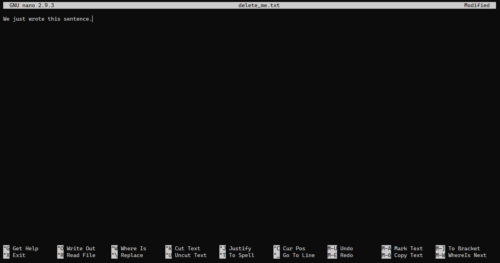

The Linux command line can be used for some rather intricate operations. Not only by successfully using all of the available commands but also by combining them! In this section we will learn about some of the operators that allow this. Moreover, we will also learn how to write proper Shell scripts that do way more than simple tasks.

## Environment variables and variables
<!-- Hidden information -->
<!-- The content in this page was inspired by: -->
<!-- https://www.educative.io/courses/master-the-bash-shell/NE8LYJ3zkM2 -->

Shell supports the use of variables. You can assign a variable any value you want. We can start with a basic example and assign a variable a numeric value:
```
$ number=1
```

The above command executes without any issues. How do we know that the variable is assigned? And how do we use it?

We can access stored variables by prefixing its name with the `$` sign (everything's about money, huh?). Knowing this, we can try it out:
```
$ $number
1: command not found
```

What happened?

When we executed `$number` the terminal looked at its value and substituted the command with a `1`. This is essentially the same as simply trying to execute `1` as a command:
```
$ 1
1: command not found
```

At the moment this might seem like silly and not really practical. Fret not! We will try to change your opinion in a moment.

Execute the following:
```
$ hello="echo Hello to you!"
```
What do you expect to see when executing either `hello` or `$hello` commands?
```
$ $hello
Hello to you!"
```

> **Note:** You're probably wondering why would one use variables and not simply `alias`. Alias can only be used to create aliases for commands. An alias cannot be assigned a plain value. Variables, on the other hand, can.

Ok, but how do we use a variable in practice? Let's do a little together: Define a variable called `name` and assign its value to **your** name. Then, use the `echo` command to print a nice gritting with your name. For instance: `Hello Linux`, where `Linux` was stored in the `name` variable.

First, we assign the `name` variable a value:
```
$ name=Linux
```
Then we execute the previously learned `echo` command with the desired text:
```
$ echo Hello $name!
Hello Linux
```

Congratulations, you now know how to use variables in Linux. Before we proceed, it's important to still discuss about good practice. Imagine we are dealing with files and file names. We want to store the file name into a variable and then append a suffix like `_new.txt`. If we use the knowledge acquired above this would look like this:

```
$ filename="very_important_document"
$ touch $filename_new.txt
```

No errors will be thrown. However, if we use `ls` to list all the files we will not be able to see our newly created `very_important_document_new.txt`. Where is it?!

To help solve the mystery we need to use `ls` with some extra parameters: `ls -la` (as we learned). If you pay attention, you will see a `.txt` file. Without a name, just the file ending. What happened?

First things first, as we once previously described, if a file has a `.` prefixed to it's name, Linux treats it as a "hidden" file and `ls` does not show it (but you already knew that). The question is, why do we see `.txt` only and what happened to the name. Try using `echo` instead of `touch` and inspect the output:

```
$ echo $filename_new.txt
.txt
```

By now you're probably tired of beating around the bush and want to hear the explanation and solution to the problem.
From the internet:
> Variable name must begin with alphanumeric character or underscore character (_), followed by one or more alphanumeric or underscore characters.

This tells us, that when we typed `$filename_new.txt` Linux understood that we're looking for the `filename_new` variable. To circumvent this issue we will double quotation marks `"`:
```
$ filename="very_important_document"
$ touch $"filename"_new.txt
```
Using `ls` will show us that the file has finally been created. Yay!

> **Note**: It is also possible to use curly braces  `{}` instead of the quotation marks. This also opens various possibilities like specifying a default value in case the variable is not defined - `${filename:-not_so_important_document}`. Useful when writing scripts

## Pipes & Redirects

In this section we will learn how we can pass the output of one command to the input of another. We will also learn how to populate files with the output of a command and much more.

<!-- Hidden information -->
<!-- The content in this page was inspired by: -->
<!-- https://www.educative.io/courses/master-the-bash-shell/3w5GrpYLENn -->
<!-- https://unix.stackexchange.com/questions/159513/what-are-the-shells-control-and-redirection-operators -->

### The pipe operator `|`

Before we show how the pipe operator `|` works, we will introduce you to very useful command - `grep`. We can for a moment pretend we are Sauron and we are looking for the Ring. Let's see if the most famous Hobbit keeps a calendar of his activities on a Ubuntu system:
```
$ grep -R Frodo /usr/share/calendar
/usr/share/calendar/calendar.lotr:03/05 Frodo & Samwise encounter Shelob
/usr/share/calendar/calendar.lotr:09/14 Frodo & Bilbo's birthday
/usr/share/calendar/calendar.lotr:09/18 Frodo and company rescued by Bombadil
/usr/share/calendar/calendar.lotr:09/28 Frodo wounded at Weathertop
/usr/share/calendar/calendar.lotr:10/05 Frodo crosses bridge of Mitheithel
```
Excellent! We know when Frodo will be where and can ambush him then. The Ring will finally be in its owners hand (on the owner's finger, to be precise).

If we look closely at what happens here we can see that `grep` looked for all the instances it could find of the word `Frodo` in the `/usr/share/calendar` directory and its sub-directories.

The help of the `grep` command tells its intended use:
```
$ grep --help
Usage: grep [OPTION]... PATTERN [FILE]...
Search for PATTERN in each FILE.
...
```
In  our case we used it as follows: `-R` is an `[OPTION]` and tells grep to look for files recursively, `Frodo` is the `PATTERN` and `/usr/share/calendar` is the `[FILE]`. In Linux, we can pipe the output of one command into the input of another. Now that we know how `grep` works, let's test out the piping with a simple example:

```
$ echo "Frodo: I will take the Ring thought I don't know the way" | grep -o Ring
Ring
```
> **Note**: We've read the help page before, but just in case you've forgotten: `-o` stands for `--only-matching` and it does `show only the part of a line matching PATTERN`

Let's look at another example: check if a file exists in a certain directory:
```
$ ls /bin | grep grep
bzegrep
bzfgrep
bzgrep
egrep
fgrep
grep
zegrep
zfgrep
zgrep
```
> **Note**: Using `grep` to filter from a long list of things is extremely useful when using for robotics. It's often used to look if a certain topic on the ROS network exists.

Another very useful Linux command that is often used for manipulating strings and file contents is `sed`. Using `sed` on a file will be showcased later. For now, we show a simple string substitution:
```
$ echo "Frodo wouldn't have got far without Sam, would he?" | sed 's/Sam/Sauron/'
```
Here, we used `sed` to substitute all occurrences of `Sam` with `Sauron`. We did so by providing `sed` a "command". The command is `s` and what is after that has the following pattern: `/<expression>/<replacement>/flags`.

> **Note**: We can stack as many piped commands as we want:
>```
>$ echo "Frodo wouldn't have got far without Sam, would he?" | grep -o Sam | sed 's/Sam/Sauron/'
>```

### The redirect operator `>` and `>>`

It's finally time to start placing content into files. We will do this with the redirect operator `>`. This operator takes the output of a command and it *redirects* it into a file.

We've learned a very handy command that produces whatever output we type. So let's try to redirect this into a file:
```
$ echo "Hello people!" > greeting.txt
```
We inspect the contents of the file and we are pleased to see that the computer is greeting us:
```
$ cat greeting.txt
```

This can be very handy when combined with `grep`. Remember how Sauron was wondering about Frodo's appointments throughout the year? It would be a shame if Sauron did not write this down and forgot it. Let's write all Frodo's appointments into file:
```
$ cat /usr/share/calendar/calendar.lotr | grep Frodo > i_want_my_ring.txt
$ cat i_want_my_ring.txt
03/05   Frodo & Samwise encounter Shelob
09/14   Frodo & Bilbo's birthday
09/18   Frodo and company rescued by Bombadil
09/28   Frodo wounded at Weathertop
10/05   Frodo crosses bridge of Mitheithel
```

> **Note**: Before we mentioned that `sed` can be used on a file and that this will be showcased later. Now it's the later:
>```
>$ sed -i 's/Bilbo/Sauron/' i_want_my_ring.txt
>$ cat i_want_my_ring.txt | grep Sauron
>09/14   Frodo & Sauron's birthday
>```
>We replaced the word `Bilbo` with Sauron directly in the file with the `-i` (`--in-place`) flag.

What happens when we use the `>` operator on the same file but with different content? Let's try it out on a simple example:
```
$ echo "We need to talk" > message.txt
```
We now remember that we forgot to sign this message and want to add our name:
```
$ echo "It's me, M" > message.txt
$ cat message.txt
It's me, M
```
That didn't work, did it? The `>` operator will replace the contents in the file. If we want to append something, we need the `>>` operator:
```
$ echo "We need to talk" > message.txt
$ echo "It's me, M" >> message.txt
$ cat message.txt
```
### The redirect operator `<`

The `<` redirect operator takes the contents of a file and redirects them to the standard input of a command written before it.

Let's try to read the `calendar.lotr` file without using the `cat` command:
```
$ grep Frodo < /usr/share/calendar/calendar.lotr
```
We can see, that the result is the same.

## File editors

Before we proceed with scripts it's time to learn about file editors that we can use in the command line. The most basic and suggested one is `nano`.

You will often hear that real pros use `vim`. However, there's this joke about `vim`:


To make our life easy and not spend the next 2 hours learning the basic usage of `vim`, we will proceed with `nano`.

Let's quickly try editing a file with `nano`:
```
$ nano delete_me.txt
```
Once this command is executed your terminal will transform into a text editor. See the image below:


Let's write something simple. Don't mind the content, as the name of the file suggests, we are going to delete it soon after.

After you wrote something, look at the bottom of the terminal window. You will see some tooltips: `^G Get help`, `^O WriteOut`, etc. These tool tips tell you what hot-keys do what. But the letters are followed by this odd character `^`. This character represents the `Ctrl` key on the keyboard. To save the file follow the `Write Out` tooltip and press `Ctrl + O`. The editor will ask you to confirm the name of the file. Simply press enter to do so. Congratulations, you now know how to use one of the text editor in Linux.

Before proceeding, let's remove the newly created file:
```
$ rm delete_me.txt
```
> **Note**: If you're having troubles exiting `nano`, follow the tooltips at the bottom. To exit `nano` simply press `Ctrl + X`.
## Scripts

We now know how to sort the output of a command, write contents into a file and read from a file. It is now time to learn how to write some shell scripts that can do complicated operations by simply invoking them.

We start with a simple script:
```
$ echo "echo \"This message came from a script\"" > my_script.sh
```
> **Note**: `/` is an escape character.

We confirm that the content of this file is as expected:
```
$ cat my_script.sh
echo "This message came from a script"
```
Question: how do we execute this?

We execute this file by asking `bash` to execute it's contents:
```
$ bash my_script.sh
This message came from a script
```
We noticed, that we are calling all the Linux commands **without** asking `bash` for an interpretation. How can we achieve this with our scripts?

First, we need to make them executable!
```
$ chmod +x my_script.sh
```
We can now execute this with:
```
$ ./my_script.sh
```
> **Note**: Executing scripts works only by providing their full path. If we put the script elsewhere, we need to run it like `./some/other/directory/my_script.sh`. To make a script accessible from anywhere we can move it to `/usr/local/bin`.

### Passing arguments to a script

Input arguments are accessible by the `$` operator. The arguments passed to a script are positional. Which means, the order we pass them is important when accessing them. The `$` operator is the prefix to the number of the positional argument we want to access. We can take the following example of calling `my_script.sh` and providing some arguments:
```
$ ./my_script.sh one two three
```
The `one`, `two` and `three` are accessible with `$1`, `$2` and `$3`, respectively. Open the `my_script.sh` file with `nano` and modify as follows:
```bash
echo This message came from a script. The first three input parameters are $1, $2 and $3.
```
Try to execute the script again with the positional arguments `one`, `two` and `three` and observe the output.

> **Note**: The `$0` stores the information of the command that has just been executed. In the above example, it would be the following string: `./my_script.sh`.

Will a fourth positional argument be printed if we provide it? Or a fifth positional argument? What if we want to support unlimited positional arguments?

In this case we can use the `$@`. This will pack all the positional arguments into an array that we can use. Using `nano` we modify the `my_script.sh` file's content to the following:
```bash
echo This message came from a script. All the provided positional arguments are: $@.
```
You can now experiment with different number of arguments.

> Further reading:
> - https://www.baeldung.com/linux/use-command-line-arguments-in-bash-script
> - https://www.linux.org/threads/bash-04-%E2%80%93-input-from-user.39293/

### Quick words about shebangs

In the future, when you are a Linux pro and your only operating system is Linux, you will look for various scripts online that do this or that task. When reading these scripts, you will quickly notice that almost all of them have this unique first line that looks something like this: `#!/bin/bash`. This is the so called **shebang**.

The purpose of this line as the first file is to instruct the kernel which interpreter should be used to run the commands in the file. When you execute a shell script in Ubuntu it will usually assume you are executing it with bash. But that might not always be the case. It is therefore good practice to add the shebang to all shell scripts.

<!-- Hidden information -->
<!-- The content in this page was inspired by: -->
<!-- https://linuxize.com/post/bash-shebang/ -->

### Conditional expressions
Before we dive into the world of conditional statements and loops, we need to learn how Bash knows if something is *true* or *false*. The built-in `test` command will evaluate if a certain statement is true or false and then exit with the relevant status. For instance, `test -a my_script.sh` will return *true* in case the `my_script` file exists or *false* in case it does not. These returns are not visible or printed! For more information, refer to the command's manual page: `man test`.

In practice, we rarely use the `test` command. Instead, we use its aliases `[` or `[[`. The statement from the previous example would therefore translate to ` [ -a my_script.sh ]` or `[[ -a my_script.sh ]]`. The `[[` is  the "upgraded versions and is supported on most modern systems.

> **Important**: The `[` and `[[` aliases is a command! This means that it **must** be followed by a whitespace! `[-a my_script.sh]` will return an error.

The list of possible flags and options how to use the conditional expressions is listed below and is taken from GNU's official pages:
```
-a file : True if file exists.
-b file : True if file exists and is a block special file.
-c file : True if file exists and is a character special file.
-d file : True if file exists and is a directory.
-e file : True if file exists.
-f file : True if file exists and is a regular file.
-g file : True if file exists and its set-group-id bit is set.
-h file : True if file exists and is a symbolic link.
-k file : True if file exists and its "sticky" bit is set.
-p file : True if file exists and is a named pipe (FIFO).
-r file : True if file exists and is readable.
-s file : True if file exists and has a size greater than zero.
-t fd   : True if file descriptor fd is open and refers to a terminal.
-u file : True if file exists and its set-user-id bit is set.
-w file : True if file exists and is writable.
-x file : True if file exists and is executable.
-G file : True if file exists and is owned by the effective group id.
-L file : True if file exists and is a symbolic link.
-N file : True if file exists and has been modified since it was last read.
-O file : True if file exists and is owned by the effective user id.
-S file : True if file exists and is a socket.

file1 -ef file : True if file1 and file2 refer to the same device and inode numbers.
file1 -nt file : True if file1 is newer (according to modification date) than file2, or if file1 exists and file2 does not.
file1 -ot file : True if file1 is older than file2, or if file2 exists and file1 does not.

-o optname : True if the shell option optname is enabled. The list of options appears
             in the description of the -o option to the set builtin (see The Set Builtin).
-v varname : True if the shell variable varname is set (has been assigned a value).
-R varname : True if the shell variable varname is set and is a name reference.
-z string  : True if the length of string is zero.
-n string  : True if the length of string is non-zero.

string1 == string2 : True if the strings are equal. When used with the [[ command, this performs pattern matching.
string1 != string2 : True if the strings are not equal.
string1 < string2  : True if string1 sorts before string2 lexicographically.
string1 > string2  : True if string1 sorts after string2 lexicographically.
```
Source: [https://www.gnu.org/software/bash/manual/html_node/Bash-Conditional-Expressions.html](https://www.gnu.org/software/bash/manual/html_node/Bash-Conditional-Expressions.html)

### Conditional statements `if` and `case`
### If this than that
<!-- Hidden information -->
<!-- The content in this page was inspired by: -->
<!-- https://linuxize.com/post/bash-if-else-statement/ -->
The `if` conditional statement is used to make decisions and perform commands based on the evaluation of a certain expression. It also supports the "else if" (`elif`) and "else" (`else`) statements. The syntax is the following.
```bash
if TEST-COMMAND1
then
  STATEMENTS1
elif TEST-COMMAND2
then
  STATEMENTS2
else
  STATEMENTS3
fi
```

Let's try a simple example. Using `nano`, write the following file (name it `if_statement.sh`) and make it executable:
```bash
#!/bin/bash
i=$1
if [[ $i == 1 ]]
then
  echo "i is 1"
elif [[ $i == 2 ]]
then
  echo "i is 2"
else
  echo "i is neither 1 or 2 but it is $i"
fi
```

Execute the script with `./if_statement 1` and observe the output. Play around with changing the value of the first argument and see different prints.
> **Note**: The above example treats `i` as a string! The `==`, `!=`, `<` and `>` conditional operators work with strings.

Let's spice things up and try to write the same script but where `i` is treated as an integer:
```bash
#!/bin/bash
i=$1
if [[ $i -eq 1 ]]
then
  echo "i is 1"
elif [[ $i -eq 2 ]]
then
  echo "i is 2"
else
  echo "i is neither 1 or 2 but it is $i"
fi
```

We cal put multiple conditions to be evaluated with a single conditional expression using the logical AND (`&&`) and OR (`||`) operators:
```bash
#!/bin/bash
i=$1
if [[ $i -eq 1 ]]
then
  echo "i is 1"
elif [[ $i -ge 2 ]] && [[ $i -le 4 ]]
then
  echo "i is between 2 and 4"
else
  echo "i is not within the desired range."
fi
```

The `if` statement can also be used with normal commands without the use of the `test` (and it's aliases, e.g. `[[`). In case of using commands the expression will be evaluated as *true* in case there are no errors. We can try this by modifying our `if_statement.sh`:
```bash
#!/bin/bash
if ls if_statement.sh
then
  echo "The command was successful! The file exists!"
else
  echo "The command returned an error. The file does not exist!"
fi
```
Try changing `ls if_statement.sh` into `ls case_statement.sh`.
### In case ...  do ...
The `case` conditional statement has the following syntax:
```bash
case EXPRESSION in

  PATTERN_1)
    STATEMENTS
    ;;

  PATTERN_2)
    STATEMENTS
    ;;

  PATTERN_N)
    STATEMENTS
    ;;

  *)
    STATEMENTS
    ;;
esac
```

Let's create a new script called `case_statement.sh` (don't forget to make it executable) and rewrite the example from `if` with `case`:
```bash
#!/bin/bash
i=$1
case $i in

  1)
    echo "i is 2"
    ;;

  2)
    echo "i is 2"
    ;;

  *)
    echo "i is neither 1 or 2 but it is $i"
    ;;
esac
```
Similarly to what we've been doing before, let's execute this script with different values of the positional argument and observe the output.

The `case` conditional statement does not understand numbers. It only works with strings. However, it does support pattern matching. We can try this out. Our task is to write a script that prints a greeting in the selected language. This script will support a limited number of languages and will warn us if we provide a language that it does not support. Our boss told that that it's imperative that it supports the following languages: English, Slovene and Klingon and the input to the script is the ISO 639-2 language code. We decide to expand the functionality and also allow the input to be case-insensitive name of the language.

```bash
#!/bin/bash
case $1 in

  slv)
    echo "Pozdravljeni!"
    ;;

  eng)
    echo "Hello!"
    ;;

  tlh)
    echo "nuqneH"
    ;;

  *)
    echo "Unsupported language code ($1). Must be one of the following: slv, eng, tlh"
    ;;
esac
```

Execute the script with different input arguments.
> **Note**: Klingon do not say hello like we do. They don't know have the concept of a social greeting. The word `nuqneH` translates to "What do you want?".

**Intermediate assignment**: Modify the above script so the user can input different kind of strings for the same language. For `slv` this would for example be: `slovenian`, `slovene`, etc. Furthermore, make the words case-insensitive so both `Slovenian` and `slovenian` work.

Hints: In `case` statements the OR condition is defined with `|`. When doing pattern matching, `[...]` will match all characters enclosed in `[` and `]`.


> Further reading:
> - https://www.gnu.org/savannah-checkouts/gnu/bash/manual/bash.html#Pattern-Matching
> - https://linuxize.com/post/bash-case-statement/

<!-- Hidden information -->
<!-- The content in this page wsdaas inspired by: -->
<!-- https://linuxize.com/post/bash-case-statement/ -->

### The `for` and `while` loops
<!-- Hidden information -->
<!-- The content in this page was inspired by: -->
<!-- https://linuxize.com/post/bash-while-loop/ -->
#### The `while` loop

The `while` statement is used to perform a loop as long as a provided condition is true. The syntax is the following:
```bash
while CONDITION
do
  COMMANDS
done
```

The best way to see how this work is with an example. Prepare a file and call it `while_loop.sh` and make it executable. Type the following few lines into the file using `nano`:
```bash
#!/bin/bash
i=0

while [[ $i -le 2 ]]
do
  echo i: $i
  ((i++))
done
```
> **Note**: The double parenthesis `((...))` is a built-in arithmetic feature of Bash. It is used to perform integer arithmetic operations and can be used without `$` to access variables.

Execute the file and observe the output:
```
$ ./while_loop.sh
i: 0
i: 1
i: 2
```
#### The `for` loop
The `for` statement is used to construct a loop that iterates through an array. The syntax is the following:
```bash
for item in LIST
do
  COMMANDS
done
```
The best way to learn something is to try an example. Let's say we are a university professor and we want to fairly grade the students that took our very unpopular course.
```bash
#!/bin/bash
brave_students=(John Jack Jane Jolene)
for idx in {0..3..1}
do
    echo "Dear ${brave_students[$idx]},"
    echo "You finished the course with the following grade: 5. You will have to repeat the course."
    echo "¯\_(ツ)_/¯"
    echo ""
done
```
> **Note**: You see the following structure: `{0..3..1}`. What this expression defines a sequence of integers. It has the following syntax: `{START..END..INCREMENT}`.

It is also possible to loop through the elements of an array directly. To achieve this, we rewrite the above for loop to the following:
```bash
#!/bin/bash
brave_students=(John Jack Jane Jolene)
for student in ${brave_students[@]}
do
    echo "Dear $student,"
    echo "You finished the course with the following grade: 5. You will have to reat the course."
    echo "¯\_(ツ)_/¯"
    echo ""
done
```

Another feature of the for loops is that it also allows C-style syntax: `((INITIALIZATION; TEST; STEP))`. For example
```bash
#!/bin/bash
for ((i = 0 ; i <= 5 ; i++)); do
  echo "Value of i is $i"
done
```


> Further reading:
> - https://linuxhint.com/bash_arithmetic_operations/

### Function definition

Bash allows us to define functions too (how cool is that, huh?). This allows us to make our scripts more readable and help us avoiding writing the same lines of code over and over again.

The basic syntax is as follows:
```bash
function_name () {
  COMMANDS
}
```
You are probably wondering "How do we define function arguments?". The answer is simple: you don't. Functions work the same way as any other Bash command when it comes to input arguments. You don't need to define, simply use them in the order they are provided.

As usual, the best way to learn something is to trying it out. So we are going to write the following script (make it executable) into a file called `use_function.sh`:
```bash
#!/bin/bash

print_args () {
   echo "This text comes from the print_args function."
   echo "These are the provided arguments:"
   for arg in "$@"
    do
        echo -e "\t\t\t\t - $arg"
    done

}

print_args sometext somemoretext number1 number2
```

> Further reading:
> - https://linuxize.com/post/bash-functions/

## Assignment

You are a professor at a multi-planetary university. This year you started a new course entitled: "The Social Impacts of the Linux Operating System in the 20nd Century". The students attending this course are from France, Ireland, USA, and Kronos (Klingon home world). It's the time of the finals and the student have had an exam of this course. You asked your assistant to collect the grades of the students and forward them to you in a CSV (comma separated values) file. The data in the file should be ordered as follows: student name, exam grade, preferred language and other comments. The assistant gave you the following file (the extra empty line at the end is mandatory, see [https://www.iso.org/obp/ui/#iso:std:iso-iec:9899:ed-3:v1:en](https://www.iso.org/obp/ui/#iso:std:iso-iec:9899:ed-3:v1:en)):
```
Miles O'Brien,84,gle,Try to tune down the chatter
Worf Rozhenko,76,tlh,Has a temper.
Jean-Luc Picard,100,fra,Getting bald but it fits the character. Keep it up.
Beverly Crusher,93,eng,

```
Your class currently has only 4 students but it seems that it was very popular so you expect many more next year. You want to write a script that generates text in the students' native languages informing them of their grade (passing criteria is 50/100) and adds comments from the assistant. This text should be printed in standard output so you can copy-paste it into an email. The text should additionally also be saved in a file with the following format: `Name_Surname.txt`.

Hints:
 - The `cut` command can cut out a single piece of data from a string with a specified delimiter: `cut -d , -f 1`.
 - The `tr` (translate) command can be used to replace one character with another: `tr ' ' '_'`.
 - It is possible to pipe a file into the while loop with the following syntax:
 - By setting the `-e` flag with `echo` it is possible to use special characters like new line `\n`.
 ```bash
while read -r line; do
  COMMANDS
done < /path/to/file
 ```
 - The `head -n <number>` command outputs the number of lines specified by `<number>` from top to bottom.
 - The `tail -n <number>` command outputs the the number of lines specified by `<number>` from bottom to top.

 > Expected time for the assignment: 45 minutes.