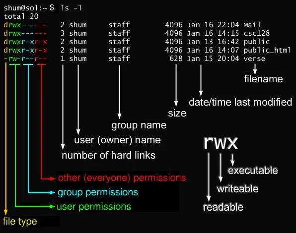

Let's start this section of the workshop with something extremely daring: peaking into the `/root` directory! Type the following command:
```
$ ls /root
ls: cannot open directory '/root/': Permission denied
```

Ok, let's try something different, for installing a new program:
```
$ apt install sl
E: Could not open lock file /var/lib/dpkg/lock - open (13: Permission denied)
E: Unable to lock the administration directory (/var/lib/dpkg/), are you root?
```
What the heck?!

## Super user do - `sudo`

In the two examples above we've learned that not all doors are open and that we can't just go about installing software. Linux in general was built with security in mind. Reading or writing system files or installing new programs is something that not everyone should have the authority to do. 

I know what you're next question is though: what if this is your computer and if you want to do whatever you please with it? Isn't making mistakes the best way to learn things?!

No worries, you can make mistakes and do whatever you please. Simply tell the Linux system that you would like to `do` things as a `su`per user with the `sudo` command:
```
sudo apt install -y sl
```
After you typed your password the program got installed. Great! You now know how to go about restrictions. Is this really safe, though? 

## Permissions
<!-- Hidden information -->
<!-- The content in this page was inspired by: -->
<!-- https://linuxfoundation.org/blog/classic-sysadmin-understanding-linux-file-permissions/ -->

What if you're the administrator of the computer with multiple users on. You don't want them all to have the power to invoke whatever command with `sudo`. However, you still want them to have some freedom within their own directory. Perhaps also share some directories between them. This is handled by permission on directories. 

Inspect the output of the following command:
```
$ ls /
total 1584
drwxr-xr-x   2 root root    4096 Oct 29  2021 bin
drwxr-xr-x   2 root root    4096 Aug 21  2020 boot
drwxr-xr-x   9 root root    2900 Jun  1 09:06 dev
drwxr-xr-x 122 root root   12288 Jun  1 09:06 etc
drwxr-xr-x   3 root root    4096 Jan 12  2021 home
-rwxr-xr-x   4 root root 1392928 Oct 27  2021 init
drwxr-xr-x  20 root root    4096 Jan 19  2021 lib
drwxr-xr-x   2 root root    4096 Jan 19  2021 lib64
drwx------   2 root root   16384 Apr 10  2019 lost+found
drwxr-xr-x   2 root root    4096 Aug 21  2020 media
drwxr-xr-x   5 root root    4096 Oct 26  2021 mnt
drwxr-xr-x   3 root root    4096 Jan 20  2021 opt
dr-xr-xr-x 344 root root       0 Jun  1 09:06 proc
drwx------   4 root root    4096 May  4 11:25 root
drwxr-xr-x   7 root root     200 Jun  2 14:27 run
drwxr-xr-x   2 root root   12288 Oct 29  2021 sbin
drwxr-xr-x   2 root root    4096 Jul 10  2020 snap
drwxr-xr-x   2 root root    4096 Aug 21  2020 srv
dr-xr-xr-x  11 root root       0 Jun  1 09:06 sys
drwxrwxrwt  44 root root  126976 Jun  2 19:54 tmp
drwxr-xr-x  12 root root    4096 Aug 25  2021 usr
drwxr-xr-x  13 root root    4096 Aug 21  2020 var
```
What is all this information?

We are going to take the `/home` directory from this list and analyze it:
```
drwxr-xr-x   3 root root    4096 Jan 12  2021 home
```
- `drwxr-xr-x` - tells us that this is a `d`irectory and lists the permission of users, groups and other:
  - `d` - Informs that the displayed entry is a `d`irectory. This flag can be one of the following:
    - `d` - `d`irectory,
    - `-` - file,
    - `l` - `l`ink.
  - `rwx` - The owner of this directory has the following permissions: `r`ead, `w`rit and e`x`ecute.
  - `r-x` - The group assigned to this directory has the following permissions: `r`ead and e`x`ecute. 
  - `r-x` - All users have the following permissions: `r`ead and e`x`ecute. 
- `3` - The number of hard links assigned to this directory.
- `root` - The owner of the directory.
- `root` - The group assigned to this directory.
- `4096` - The size in bytes.
- `Jan 12  2021` - The date when the directory was last modified.
- `home` - The name of the directory
  
> **Note**: Try using `ls` with the `-h` flag and observe how the size of the files/directories gets displayed.



The permissions apply only to the directory itself and not too all the other subdirectories in the hierarchy. Let's try this in practice. Try creating a directory called `user1` in the `/home` directory:

```
$ mkdir /home/user1
mkdir: cannot create directory ‘user1’: Permission denied
```

Let's now have a look at the permissions of your own home directory: 
```
$ ls -l /home
drwxr-xr-x  6 user user 4096 Mar 26  2020 user
```
As expected, we do have permissions to create directories in our space as we are the owner of this directory and the owner has the following permissions; `dwx` - `r`ead, `w`rite and e`x`ecute.

> **Note**: As you can see, the permission flags for this directory are `rwxr-xr-w`. Pay attention to the last part: `r-w`. What does this mean in terms of privacy? Exactly, by default, just about **anyone** can see the contents of this directory.

### Changing permissions bits

We now learned that files and directories in Linux has owners, groups and permissions. How do we go and change those? How do we modify the permissions in our directory?

Let's start with creating a simple file in `~` called `secret`:
```
$ touch secret
```
If we check check the details of this file we can see it has the following permissions
```
$ ls -l secret
-rw-rw-r-- 1 user user 0 Jun  5 14:30 secret
```
This means, that we, as an owner, can read and write into it. So can everyone else from our group. However, every other user that does not belong to the same group as we, can only read this file. But we don't want that. It's a secret. Only we should be able to read it.

We can change this by `ch`anging the file `mod`e bits with the `chmod` command:
```
$ chmod o-r secret
```
If you inspect the permissions of the `secret` file again you will notice a change:
```
$ ls -l secret
-rw-rw-r-- 1 user user 0 Jun  5 14:30 secret
```

Success! Keep this in mind for later.

For now, we will provide a cheat sheet for the commands that help you manipulate with permissions. They will come handy later for the exercise.

### `chmod`
The `chmod` command offers two methods to manipulate with permissions on a single file or directory:
1. by specifically adding (`+`) or removing (`-`) specific permissions (`rwx`) to the different permission groups (`u`, `g`, `o` or `a`). Examples:
   1. Give everyone (owner, group and others) the permission to read the `secret` file:
   ```
   $ chmod a+r secret
   ```
   2. Give the group the permission to execute the file: 
   ```
   $ chmod g+x secret
   ```
   3. Remove the permission to modify the file from others:
   ```
   $ chmod o-w secret
   ```
2. by defining the permissions bits where `rwx` each represent one bit (`r` is the last bit, `w` is the second bit and `x` is the first bit).
    1. Give everyone (owner, group and others) the permission to **only** read the `secret` file:
   ```
   $ chmod 444 secret
   ```
   2. Give **only** the group the permission to **only** execute the file: 
   ```
   $ chmod 010 secret
   ```
   3. Give everyone except the others the permission to only read the file:
   ```
   $ chmod 440 secret
   ```
> **Note**: there is a helpful website to help with calculating the permission numbers: [chmod-calculator.com](https://chmod-calculator.com/)


## Users & Groups

As mentioned, a single Linux system might have multiple users. We mentioned briefly that groups exist. Linux supports the creation and management of groups. Each user can belong to multiple groups. Before you learned that directories and files have a specific permissions for the group owning the file. This allows for some very dynamic and interesting settings.

### Groups

Let's first learn about what are the groups we belong to:
```
$ groups
user
```

We can create groups with `addgroups` command. For the sake of learning, let's create group called `readers`:
```
addgroups readers
```
We can now start experimenting. Create a directory in `Desktop` called `only-readers`:
```
$ mkdir ~/Desktop/only-readers
```

Try out what you can do. For instance, navigate into it with the `cd` command, list what is in that directory with `ls`, create a new file in that directory with `touch`, etc. 

Let's now change the group of this directory and assign permissions of `rwx` to the group only. Navigate to the `Desktop` and invoke the following commands:
```
$ chgrp readers only-readers
$ chmod 070 only-readers
```
Repeat the actions from before, i.e. `cd`, `ls`, `touch`. Can you still do it? You can. However, let's now `ch`ange the `gr`oup of the `only-readers` directory:
```
$ chgrp readers only-readers
```
Try the `cd`, `ls` and `touch` commands. What's the result? 

The reason why you no longer able to do anything there is because this directory's usage is now limited only to the group `readers` and you're not part of it. We can change this, though:
```
$ usermod -a -G readers user
```
> **Note**: `-a` stands for `append` and `-G` stands for a list of groups. To know more check the help page - `usermod --help`.

Finally, we again gained power of the `only-readers` directory. Yay!

### Users

There are two very similar commands in Linux to create a user: `useradd` and `adduser`:
- `useradd` - used to create a user or modifying existing one. It does not create anything else.
- `adduser` - provides a command line wizard to create a new user. It also creates a new group for the user and the respective directory in `/home`.

Create a user to test things out with the `useradd` command:
```
$ useradd -p 1234 reader 
```
> **Note**: This is just a demo. Do not use simple passwords as `1234` in your daily life.

Make sure you are in the `~/Desktop` directory and let's now `s`ubstitute `u`sers and log in as `reader`:
```
$ su reader
```
We are now looking at the system through the eyes of the `reader` user. Try to create a simple directory on the desktop. Does it work? As expected, it does not. The user `reader` has no business messing around the directories of the `user` user. Let's switch back to the `user` user:
```
$ su user
```

Lets add our `reader` into the `readers` group:
```
$ usermod -a -G readers reader
```

Switch back to the `reader` user and try creating a directory or file inside `only-readers` directory. What are your findings?
<!-- Hidden information -->
<!-- The content in this page was inspired by: -->
<!-- https://www.linux.com/topic/desktop/how-manage-users-groups-linux/ -->

### `chown`
The command with which we can `ch`ange the file `ow`ner and its group is `chown`. Let's make a file that is only readable by the `reader` user in the `only-readers` directory. Even we won't be able to read it!

Switch back to the `user` and create a file called `secret` in the `only-readers` directory:
```
$ touch secret
```
Set the permissions so that only the user can do everything:
```
$ chmod 700 secret
```
> **Note**: In this case 7 stands for all three bits set to 1: `r`, `w` and `x`.

Finally, change the owner of the file:
```
$ chown reader secrets
```
If we try to read certain properties of this file we won't be allowed to:
```
$ ls -l secrets
```

<!-- ## Sudoers -->

## Exercise

In this exercise you will be creating an environment of directories for your neighborhood. In there there will be various directories, each serving a specific purpose. 

1. In the root path (`/`) create a directory called `neighborhood`
2. Create a new user with `adduser` for the person sitting next to you (let them chose their own password)
3. In the directory dedicated to the neighborhood you should create three different directories and adjust their permissions accordingly:
   1. bulleting board - everyone can read but only certain people in the neighborhood can write
   2. share files - each neighbor has their own directory in which they can read and write as they please. Other people are able to only read.
   3. administration - only the neighborhood administrators can write and read in this directory
